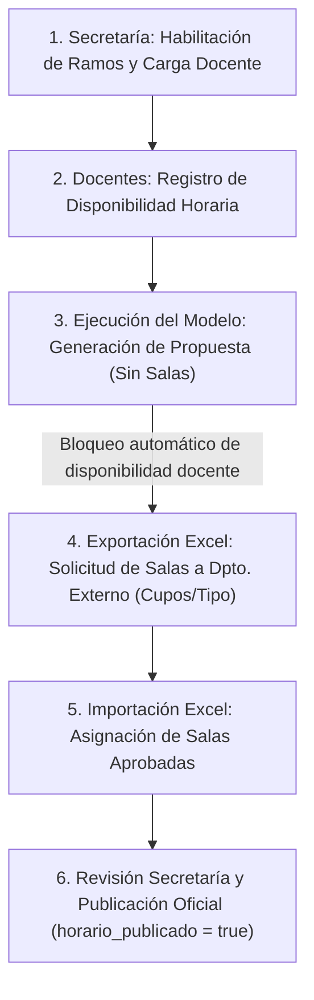

# Sistema Web para la Optimización de Horarios Académicos

> **Proyecto de Título** — Ingeniería Civil en Informática  
> *Universidad del Bío-Bío (UBB)*

[](https://www.typescriptlang.org/)
[](https://nodejs.org/)
[](https://expressjs.com/)
[](https://www.postgresql.org/)
[](https://orm.drizzle.team/)
[](https://pnpm.io/)

---

## 📌 Descripción del Proyecto

Aplicación web integral diseñada para automatizar y optimizar la planificación de horarios semestrales en carreras universitarias (con enfoque aplicado al departamento de Ingeniería Civil en Informática de la UBB).

El sistema resuelve un problema combinatorio de alta complejidad (*Timetabling Problem*) mediante un motor de optimización matemática que considera disponibilidad docente, capacidades de salas, topes de asignaturas y cargas horarias.

---

## 🔄 Flujo Operativo Principal



1. **Gestión Académica**: La secretaría/coordinación habilita la oferta de asignaturas del semestre y asigna la carga correspondiente a cada docente.
2. **Disponibilidad Docente**: Los profesores ingresan sus bloques de disponibilidad horaria mientras el semestre está en fase de recepción.
3. **Optimización Automática (Propuesta sin Sala)**: El sistema ejecuta el modelo matemático/solver que asigna bloques horarios minimizando choques de asignaturas y preferencias docentes. Los bloques se registran con `sala_id = null`. Al existir horarios generados para el semestre, la disponibilidad docente queda **bloqueada automáticamente**.
4. **Solicitud de Infraestructura (Exportación Excel)**: Se exporta la propuesta de horarios a formato Excel detallando necesidades de cupos, bloques y tipos de sala para enviarlo a la unidad universitaria encargada de la administración central de aulas.
5. **Carga de Salas Aprobadas (Importación Excel)**: Tras la respuesta de la unidad de salas, se importa la planilla para asociar cada bloque de clase con su `sala_id` definitiva.
6. **Ajuste y Publicación Oficial**: La secretaría realiza ajustes manuales de última hora si se requiere y activa la publicación oficial del horario (`horario_publicado = true`) para consulta de toda la comunidad universitaria.

---

## 🛠️ Stack Tecnológico

| Capa | Tecnología | Descripción |
| :--- | :--- | :--- |
| **Backend** | **Node.js + Express + TypeScript** | API REST estructurada con arquitectura limpia en capas y tipado estricto. |
| **Base de Datos** | **PostgreSQL** | Motor relacional robusto y ACID para persistencia de datos. |
| **ORM / DAL** | **Drizzle ORM + Drizzle Kit** | Tipado TypeScript nativo de extremo a extremo y control de migraciones. |
| **Validación** | **Zod** | Validación de esquemas y DTOs en tiempo de ejecución con mensajes en español. |
| **Frontend** | **React + TypeScript** *(en desarrollo)* | Interfaz moderna, reactiva e intuitiva para secretaría y docentes. |
| **Package Manager** | **pnpm** | Gestión estricta y eficiente de dependencias monorepo/multi-paquete. |

---

## 🏛️ Arquitectura del Backend

El backend sigue los principios de **Clean Architecture** con separación estricta de responsabilidades en capas:

```text
backend/src/
├── config/          # Variables de entorno validadas con Zod y cliente DB
├── controllers/     # Manejo de peticiones y respuestas HTTP
├── db/
│   ├── schema/      # Definición de tablas y relaciones con Drizzle ORM
│   ├── migrations/  # Migraciones SQL generadas por Drizzle Kit
│   └── seed.ts      # Población inicial de catálogos base (bloques UBB, salas, deptos, carreras)
├── middlewares/     # Manejador global de errores y validación Zod
├── repositories/    # Capa de acceso a datos (consultas SQL y transacciones atómicas)
├── routes/          # Definición y mapeo de endpoints REST
├── services/        # Lógica de negocio, reglas de dominio y errores tipados
├── utils/           # Helpers puros, manejo de errores y constantes
└── validations/     # Esquemas Zod para validación de DTOs y parámetros con mensajes en español
```

---

## ⏳ Tareas Pendientes y Estado del Proyecto

- [x] **Control de Bloqueo de Disponibilidad Docente**: Regla de negocio implementada en `disponibilidad.service.ts` para congelar automáticamente la edición/sincronización de disponibilidad docente una vez generadas propuestas de horarios para el semestre.
- [x] **Diferenciación de Horario Propuesta vs Oficial**: Columna `horario_publicado` en `semestres` y campo `sala_id` opcional/nullable en `horarios_asignaturas` para soportar horarios borrador antes de la asignación de infraestructura física.
- [ ] **Gestión de Archivos Excel (Flujo de Solicitud y Asignación de Salas)**:
  - **Exportación de Solicitud de Salas (Excel)**: Generar planilla con la propuesta de horarios del modelo (asignaturas, secciones, bloques, cupos y tipos de aula) para tramitar la reserva de infraestructura con el departamento externo de salas de la universidad.
  - **Importación y Vinculación de Salas (Excel)**: Leer la planilla de respuesta de salas y actualizar masivamente `horarios_asignaturas` vinculando cada bloque con su `sala_id`.
  - **Carga y Reportes Base**: Endpoints auxiliares para carga masiva de catálogos y descarga de matrices horarias consolidadas.

---

## 🚀 Puesta en Marcha (Backend)

### Requisitos Previos
* [Node.js](https://nodejs.org/) (v20 o superior)
* [pnpm](https://pnpm.io/) (`npm install -g pnpm`)
* [Docker & Docker Compose](https://www.docker.com/)

### Instalación y Ejecución

1. **Iniciar Base de Datos con Docker**:
   ```bash
   docker compose up -d postgres pgadmin
   ```

2. **Instalar dependencias e iniciar desarrollo**:
   ```bash
   cd backend
   pnpm install
   pnpm dev
   ```

3. **Comandos de Base de Datos**:
   ```bash
   pnpm run db:generate   # Generar nuevas migraciones SQL
   pnpm run db:migrate    # Aplicar migraciones a PostgreSQL
   pnpm run db:seed       # Poblar catálogos base (bloques UBB, salas, etc.)
   pnpm run db:studio     # Abrir visor web Drizzle Studio
   ```
