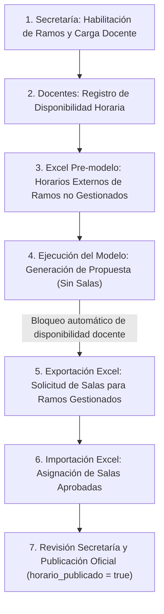

# Sistema Web para la Optimización de Horarios Académicos

> **Proyecto de Título** — Ingeniería Civil en Informática  
> *Universidad del Bío-Bío (UBB)*

[](https://www.typescriptlang.org/)
[](https://nodejs.org/)
[](https://expressjs.com/)
[](https://www.postgresql.org/)
[](https://orm.drizzle.team/)
[](https://pnpm.io/)

---

## 📌 Descripción del Proyecto

Aplicación web integral diseñada para apoyar la planificación de horarios semestrales en carreras universitarias, con enfoque aplicado al contexto de Ingeniería Civil en Informática de la UBB y su coordinación académica.

El sistema aborda un problema combinatorio de alta complejidad (*Timetabling Problem*) mediante un flujo que combina gestión académica, disponibilidad docente, exportación/importación Excel y, como objetivo del proyecto, un motor de optimización matemática que considere disponibilidad docente, capacidades de salas, topes de asignaturas y cargas horarias.

> Este repositorio corresponde a un prototipo de Proyecto de Título. No está pensado como plataforma institucional productiva general, sino como una implementación funcional y reproducible para el contexto académico definido.

---

## 🔄 Flujo Operativo Principal



1. **Gestión Académica**: La secretaría/coordinación habilita la oferta de asignaturas del semestre y asigna la carga correspondiente a cada docente dentro del alcance de su carrera.
2. **Disponibilidad Docente**: Los profesores ingresan sus bloques de disponibilidad horaria mientras el semestre está en fase de recepción.
3. **Horarios Externos Pre-modelo** *(pendiente)*: Para ramos de la carrera dictados por departamentos no gestionados directamente por la secretaría, se contempla un flujo Excel previo donde se reciban horarios externos ya definidos. Las salas no son relevantes para este flujo.
4. **Optimización Automática (Propuesta sin Sala)**: El sistema ejecuta el modelo matemático/solver que asigna bloques horarios minimizando choques de asignaturas y preferencias docentes. Los bloques se registran con `sala_id = null`. Al existir horarios generados para el semestre, la disponibilidad docente queda **bloqueada automáticamente**.
5. **Solicitud de Infraestructura (Exportación Excel)**: Se exporta la propuesta de horarios a formato Excel detallando necesidades de cupos, bloques y tipos de sala para enviarlo a la unidad universitaria encargada de la administración central de aulas.
6. **Carga de Salas Aprobadas (Importación Excel)**: Tras la respuesta de la unidad de salas, se importa la planilla para asociar cada bloque de clase con su `sala_id` definitiva.
7. **Ajuste y Publicación Oficial**: La secretaría realiza ajustes manuales de última hora si se requiere y activa la publicación oficial del horario (`horario_publicado = true`) para consulta de toda la comunidad universitaria.

---

## 🛠️ Stack Tecnológico

| Capa | Tecnología | Descripción |
| :--- | :--- | :--- |
| **Backend** | **Node.js + Express + TypeScript** | API REST estructurada con arquitectura limpia en capas y tipado estricto. |
| **Base de Datos** | **PostgreSQL** | Motor relacional robusto y ACID para persistencia de datos. |
| **ORM / DAL** | **Drizzle ORM + Drizzle Kit** | Tipado TypeScript nativo de extremo a extremo y control de migraciones. |
| **Validación** | **Zod** | Validación de esquemas y DTOs en tiempo de ejecución con mensajes en español. |
| **Frontend** | **React + TypeScript** *(en desarrollo)* | Interfaz moderna, reactiva e intuitiva para secretaría y docentes. |
| **Package Manager** | **pnpm** | Gestión estricta y eficiente de dependencias monorepo/multi-paquete. |

---

## 🏛️ Arquitectura del Backend

El backend sigue los principios de **Clean Architecture** con separación estricta de responsabilidades en capas:

```text
backend/src/
├── config/          # Variables de entorno validadas con Zod y cliente DB
├── controllers/     # Manejo de peticiones y respuestas HTTP
├── db/
│   ├── schema/      # Definición de tablas y relaciones con Drizzle ORM
│   ├── migrations/  # Migraciones SQL generadas por Drizzle Kit
│   ├── seeds/       # Datos base y módulos de carga del seed único no destructivo
│   └── seed.ts      # Entrypoint del seed: asegura catálogos, relaciones y usuarios iniciales
├── middlewares/     # Manejador global de errores y validación Zod
├── repositories/    # Capa de acceso a datos (consultas SQL y transacciones atómicas)
├── routes/          # Definición y mapeo de endpoints REST
├── services/        # Lógica de negocio, reglas de dominio y errores tipados
├── utils/           # Helpers puros, manejo de errores y constantes
└── validations/     # Esquemas Zod para validación de DTOs y parámetros con mensajes en español
```

---

## 🧭 Alcance por Carrera y Departamento

El sistema modela el alcance operativo de secretaría desde la carrera asociada al usuario:

```text
usuarios → secretarias.usuario_id → secretarias.carrera_id
```

La relación `carrera_departamento` indica que un departamento presta servicios a una carrera. Además, el campo `es_gestionado` distingue si ese departamento es gestionado operativamente por la carrera/secretaría.

| Concepto | Significado |
| :--- | :--- |
| Fila en `carrera_departamento` | El departamento presta servicios a la carrera. |
| `es_gestionado = true` | La secretaría/carrera gestiona operativamente ramos de ese departamento. |
| `es_gestionado = false` | El departamento presta servicios, pero sus horarios deben coordinarse como externos. |

Departamentos gestionados inicialmente para el prototipo:

- Sistemas de Información
- Economía y Finanzas
- Administración y Auditoría

Este diseño permite separar tres necesidades:

1. vistas y edición de secretaría limitadas a su carrera;
2. exportación Excel de salas para ramos gestionados;
3. futuro Excel pre-modelo para horarios de ramos externos.

---

## 🌱 Seed del Proyecto

El proyecto mantiene un **seed único real**, no separado entre `base` y `dev`, porque el despliegue corresponde a un prototipo de tesis con datos controlados.

```bash
cd backend
pnpm run db:seed
```

El seed:

- conserva `backend/src/db/seed.ts` como entrypoint;
- organiza datos y carga en `backend/src/db/seeds/`;
- no ejecuta `TRUNCATE` ni borra datos existentes;
- asegura datos necesarios creando o actualizando registros;
- carga catálogos académicos, bloques horarios, salas y usuarios iniciales del prototipo.

Los usuarios y contraseñas iniciales son parte del contexto del prototipo y no representan una política de seguridad productiva institucional.

---

## ⏳ Estado del Proyecto

### Implementado

- [x] **Backend Express + TypeScript + Drizzle ORM** con arquitectura limpia en capas.
- [x] **Control de Bloqueo de Disponibilidad Docente**: Regla de negocio implementada en `disponibilidad.service.ts` para congelar automáticamente la edición/sincronización de disponibilidad docente una vez generadas propuestas de horarios para el semestre.
- [x] **Publicación por Entrada de Horario**: `semestres_horarios` relaciona directamente `semestre_id` y `horario_asignatura_id`, con un único registro por entrada y `horario_publicado=false` por defecto. No existe una tabla agregada `horarios` ni un `horario_id` adicional en las entradas. La clave foránea compuesta garantiza que el semestre coincida con el de la entrada; las actualizaciones y eliminaciones de esta última se propagan por cascada. `sala_id` sigue siendo opcional/nullable, independientemente de la publicación.
  - **API existente**: `horarioPublicado` se lee y escribe en `/api/horarios-asignaturas`, no en la API de semestres ni en sus respuestas anidadas. Se conserva `semestreId`. Crear o actualizar una entrada gestiona su publicación en la misma transacción. No hay nuevos endpoints, versiones ni requisitos para publicar; crear un semestre vacío no genera entradas ficticias.
  - **Migración**: `0006_youthful_tigra.sql` copia el booleano original del semestre a cada entrada antes de retirar la columna antigua. No cambia IDs existentes ni salas. Si existe un semestre publicado sin entradas, aborta con una excepción antes de cambiar el esquema: ese estado no puede preservarse en una relación por entrada y requiere resolución explícita. Los semestres vacíos no publicados no generan relaciones. Aplicarla requiere respaldo y validación previa en PostgreSQL aislado y descartable.
- [x] **Excel de Asignación Externa de Salas**:
  - Exportación de propuesta de horarios a `.xlsx` con salas vacías para completar externamente.
  - Importación todo-o-nada del mismo formato para vincular salas aprobadas a `horarios_asignaturas`.
  - Nombre de archivo `Resumen Malla ({codigoSemestre}).xlsx` y hoja `Resumen Malla`.
  - Validaciones con errores corregibles por fila/columna.
- [x] **Alcance Carrera-Departamento**: `carrera_departamento.es_gestionado` diferencia departamentos que prestan servicios de departamentos gestionados por la secretaría/carrera.
- [x] **Seed Único No Destructivo**: `db:seed` asegura datos base del prototipo sin borrar datos existentes.

### Pendiente

- [ ] **Filtro transversal por secretaría/carrera**: limitar vistas y acciones de secretaría a ramos de su carrera mediante `secretarias.usuario_id → carrera_id` y `carrera_asignatura`.
- [ ] **Mejorar exportación Excel de salas por alcance**: exportar solo ramos de la carrera cuyo profesor pertenezca a un departamento marcado como `es_gestionado=true` para esa carrera.
- [ ] **Excel pre-modelo de horarios externos**: recibir horarios de ramos de la carrera dictados por departamentos relacionados pero no gestionados (`es_gestionado=false`).
- [ ] **Integración del solver/modelo de optimización**: generar propuestas horarias desde el backend.
- [ ] **Frontend React**: construir la interfaz de secretaría y docentes sobre la API existente.

---

## 🚀 Puesta en Marcha (Backend)

### Requisitos Previos
* [Node.js](https://nodejs.org/) (v20 o superior; v22 recomendado)
* [pnpm](https://pnpm.io/) (`npm install -g pnpm`)
* [Docker & Docker Compose](https://www.docker.com/)

### Instalación y Ejecución

1. **Iniciar Base de Datos con Docker**:
   ```bash
   docker compose up -d postgres pgadmin
   ```

2. **Instalar dependencias e iniciar desarrollo**:
   ```bash
   cd backend
   pnpm install
   pnpm dev
   ```

3. **Comandos de Base de Datos**:
   ```bash
   pnpm run db:generate   # Generar nuevas migraciones SQL
   pnpm run db:migrate    # Aplicar migraciones a PostgreSQL
   pnpm run db:seed       # Asegurar datos base del prototipo sin borrar datos existentes
   pnpm run db:studio     # Abrir visor web Drizzle Studio
   ```

### Verificación recomendada

```bash
cd backend
pnpm run build
pnpm exec tsc --noEmit
pnpm exec vitest run tests/schema-organization.test.ts
pnpm exec vitest run tests/semestres.test.ts tests/horarios.test.ts tests/semestres-horarios.test.ts
```

Los checks de esquema, migración y SQL son independientes de la base configurada. Las suites de integración que ejercitan comportamiento real de PostgreSQL requieren una base local disponible y aislada. No ejecutar la suite completa contra una base compartida o con datos importantes.
